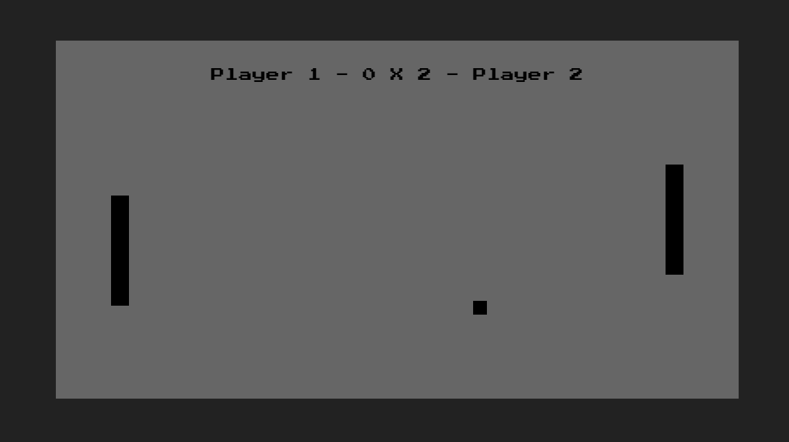

# Pong Game 🎮

Inspirado em Pong, um jogo eletrônico originalmente lançado em 1972 e desenvolvido pela Atari, também resolvi recriá-lo com a possibilidade de jogar com dois players. 


Ao iniciar a partida, o **PLAYER 1** utiliza as teclas `W` para mover-se para cima e  `S` para mover-se para baixo.

Já o **PLAYER 2** utiliza a seta `↑` para mover-se para cima e  `↓` para mover-se para baixo.
<br><br>

O primeiro jogador a atingir **5 pontos** será o vencedor, assim podendo reiniciar a partida.

<br><br>
# Teste o código na sua máquina 
```git clone 'https://github.com/HarlonGarcia/PongGame.git'```